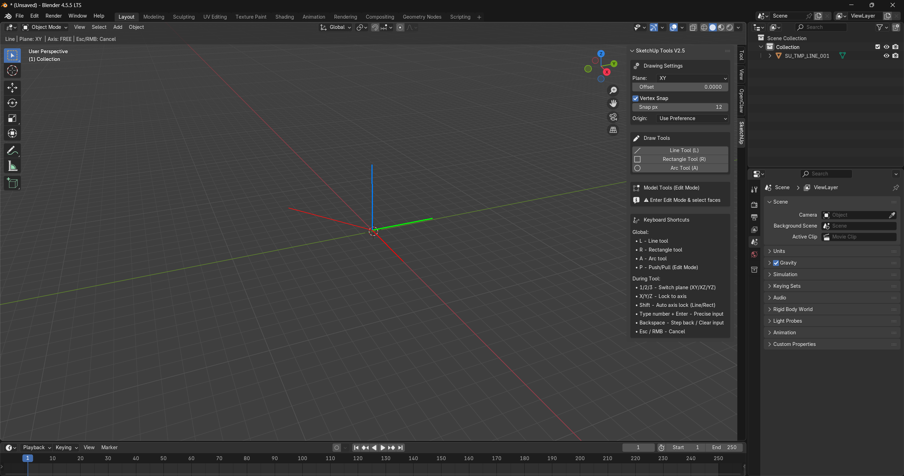

# Blender SketchUp Tools (Grid Mode) – Enhanced


SketchUp-style modeling tools for **Blender 4.5 LTS**  
Designed for fast architectural and technical modeling workflows.

---

## Preview

<p align="center">
  
</p>

---

## Overview

Blender SketchUp Tools (Grid Mode) brings intuitive SketchUp-like drawing behavior into Blender.

This add-on is focused on:

- Clean grid-based drawing
- Fast architectural modeling
- Precise numeric input
- Axis locking
- Vertex snapping
- Non-destructive workflow logic

Built specifically for users who want the simplicity of SketchUp inside Blender.

---

# Installation

## Method 1 – Direct Install (Recommended)

1. Open **Blender 4.5 LTS**
2. Go to:

   ```
   Edit → Preferences → Add-ons
   ```

3. Click **Install**
4. Select:

   ```
   sketchup-tools.py
   ```

5. Enable the add-on

You will now find the tools in:

```
3D View → Sidebar (Press N) → SketchUp
```

---

## Method 2 – Manual Folder Install

1. Create a folder:

   ```
   sketchup_tools_grid
   ```

2. Place `sketchup-tools.py` inside it
3. Copy the folder to:

   **Windows**
   ```
   C:\Users\YOUR_USERNAME\AppData\Roaming\Blender Foundation\Blender\4.5\scripts\addons\
   ```

4. Restart Blender
5. Enable the add-on from Preferences

---

# Tools Included

## Draw Tools

### Line Tool (L)
- SketchUp-style line drawing
- Axis locking (X / Y / Z)
- Numeric length input
- Vertex snapping

### Rectangle Tool (R)
- Click-drag rectangle creation
- Type width and height while drawing
- Axis constrained

### Arc Tool (A)
- 3-point arc creation
- Adjustable segment resolution
- Snap enabled

---

## Model Tools (Edit Mode)

### Push/Pull (P)
- Select face
- Drag to extrude
- Supports numeric input
- Clean extrusion logic

---

# Shortcuts

| Key | Action |
|-----|--------|
| L | Line Tool |
| R | Rectangle Tool |
| A | Arc Tool |
| P | Push/Pull (Edit Mode) |
| X / Y / Z | Axis Lock |
| Enter | Confirm |
| Backspace | Clear Input |
| ESC / Right Click | Cancel |

---

# Features

- Grid Mode drawing (XY / XZ / YZ)
- Vertex snapping system
- Axis guides visualization
- KDTree snap logic
- GPU draw handlers
- Non-destructive temporary geometry
- Smart origin logic
- Optimized for architectural workflows

---

# Add-on Settings

Go to:

```
Edit → Preferences → Add-ons → SketchUp Tools
```

Options include:

- Snap strength
- Arc segments
- Grid size
- Axis guide visibility
- Hotkey enable/disable

---

# Blender Version

Tested on:

```
Blender 4.5 LTS
```

Older versions are not officially supported.

---

# Technical Overview

Built using:

- Blender BMesh API
- GPU draw handlers
- KDTree snapping system
- Non-destructive temporary mesh logic

Optimized for performance and real-time viewport interaction.

---

# License

MIT License  
Free to use, modify, and distribute.

---

# Author

Developed by  
**Ammar Alrubayie**

---

# Roadmap (Planned Improvements)

- Dynamic axis inference
-sultanocean.com
- Enhanced arc snapping
- Smart face auto-detection
- Precision modeling improvements

---

# Contributing

Pull requests are welcome.  
For major changes, please open an issue first.

---

# Support

If you find this useful:

⭐ Star the repository  
🛠 Share feedback  
🚀 Suggest improvements  

---

Blender SketchUp Tools (Grid Mode) – Enhanced  
Simple. Fast. Precise.
